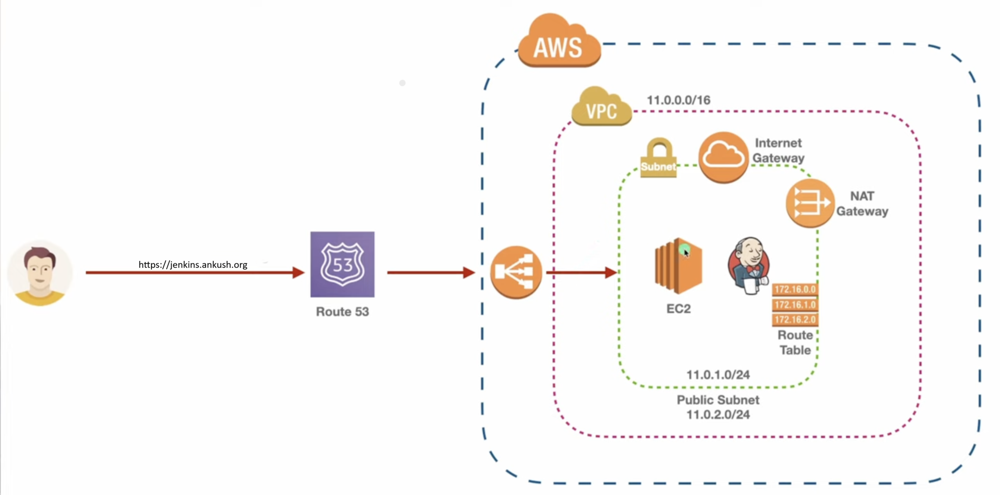

# Phase 1:

## Rest API
- Python Application Code Using Flask API
- REST API - GET, POST, DELETE, Patch
- Mysql for fetching and storing data

# Phase 2:

## EC2 infrastructure as code in Terraform
- VPC
- 4 Subnet (2 public, 2 private)
- Route Table
- Internet Gateway
- Target Group
- Elastic Load Balancer
- Route 53 -Domain Management
- Certificate Manager - Https
- RDS- MySQL

# Phase 3:
## Setting Jnekins
- Terraform - Setting up Jenkins
- Creating jenkins pipeline
- Pipeline will setup intrastructure and deploy application.
